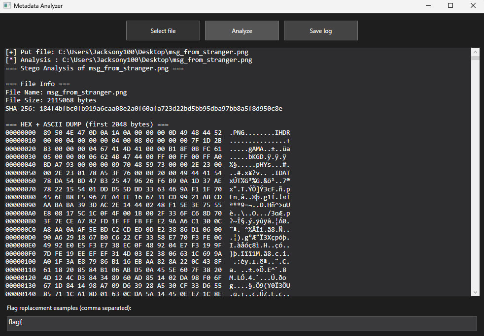

# 📂 MetaAnalyzer

A powerful and easy-to-use tool for analyzing hidden metadata, performing basic steganalysis, and detecting embedded files or flags inside images and PDF documents.

---

[](https://github.com/Jacksony100/MetaAnalyzer/actions)
[](LICENSE)
[](https://github.com/Jacksony100/MetaAnalyzer)

---

## 🖥️ UI Preview



---

## 🚀 Features

- Extracts metadata from images (JPEG, PNG, EXIF)
- Analyzes PDF documents for embedded files and anomalies
- Calculates file entropy and visualizes patterns
- Detects hidden ZIP archives, Base64 blocks, and ASCII strings
- Built-in flag scanner for CTF-style challenges
- LSB (Least Significant Bit) noise estimation
- Modern WPF interface with dark theme
- Single-file EXE build (no external DLLs required)

---

## 🔥 Installation

```bash
git clone https://github.com/Jacksony100/MetaAnalyzer.git
cd MetaAnalyzer
